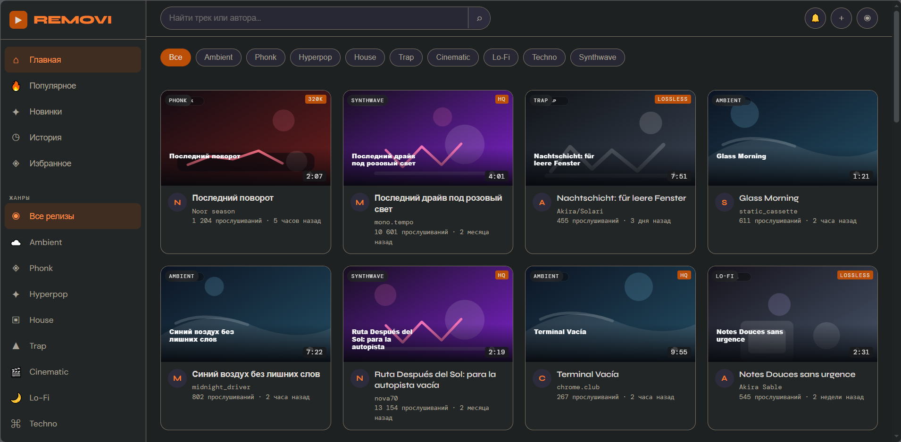
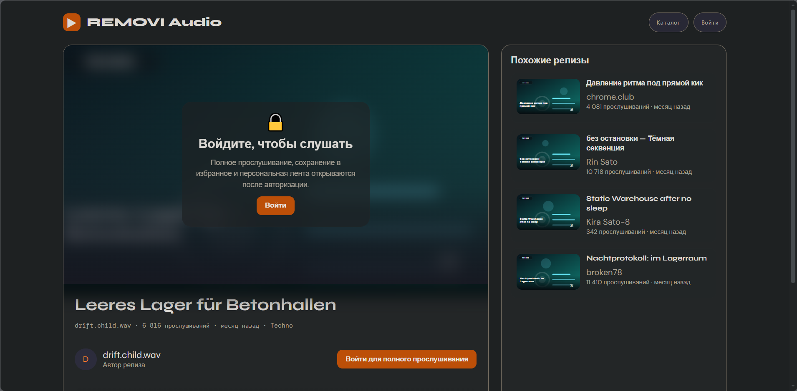
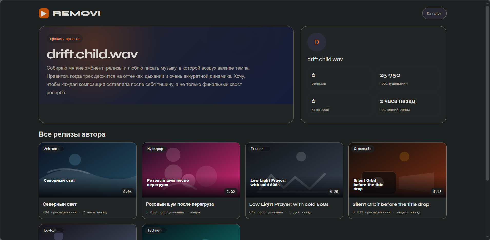

# fallback_videohub

Фронтенд-витрина REMOVI Audio с каталогом релизов, страницами треков и профилями авторов. Проект можно поднимать через `Docker Compose` с `nginx` и TLS или запускать локально напрямую через `node server.js`.

Репозиторий: `https://github.com/Laynholt/fallback_videohub.git`

## Скриншоты

### Каталог



### Страница релиза



### Страница автора



## Что есть в проекте

- главная страница с каталогом и фильтрами по жанрам;
- поиск по названию трека и имени автора;
- страница релиза с блоком похожих работ;
- страница автора со статистикой и всеми публикациями;
- JSON API для каталога, карточки релиза и страницы автора;


## Быстрый запуск через Docker Compose

Это основной сценарий для запуска с `nginx`, HTTPS и пробросом сертификатов.

```bash
git clone https://github.com/Laynholt/fallback_videohub.git
cd fallback_videohub
cp .env.example .env
docker compose up -d --build
```

После запуска доступны:

- `https://SITE_DOMAIN:NGINX_HTTPS_PORT` для HTTPS;
- `http://SITE_DOMAIN:NGINX_HTTP_PORT` для HTTP с редиректом на HTTPS.

Перед первым запуском нужно заполнить `.env` корректными значениями домена и путей к TLS-сертификатам.

## Переменные окружения

Пример лежит в [.env.example](/f:/Data/Code/JavaScript/Fallback/.env.example).

| Переменная | Что делает |
| --- | --- |
| `APP_PORT` | Внутренний порт Node.js-приложения в контейнере `app`. |
| `NGINX_HTTPS_PORT` | HTTPS-порт `nginx`. По умолчанию используется `9443`. |
| `NGINX_HTTP_PORT` | HTTP-порт для редиректа на HTTPS. |
| `SITE_DOMAIN` | Домен сайта, который подставляется в конфиг `nginx`. |
| `CERT_FULLCHAIN_PATH` | Путь на хосте к `fullchain.pem`. |
| `CERT_PRIVKEY_PATH` | Путь на хосте к приватному ключу TLS. |

`docker-compose.yml` передает `APP_PORT` в контейнер как переменную `PORT`, а `nginx.conf` собирается через `envsubst` во время старта контейнера.

## Локальный запуск без Docker

Если `nginx` и TLS не нужны, приложение можно поднять напрямую:

```bash
# Linux/macOS
PORT=8085 node server.js
```

```powershell
# Windows PowerShell
$env:PORT=8085
node server.js
```

После этого приложение будет доступно на `http://127.0.0.1:8085`.

## Основные маршруты

- `/` — каталог релизов;
- `/video/:id` — страница релиза;
- `/channel/:author` — страница автора.

Старые URL автоматически редиректятся:

- `/player.html?id=...` -> `/video/:id`
- `/channel.html?author=...` -> `/channel/:author`

## API

- `/api/catalog` — каталог с пагинацией, фильтрами и поиском;
- `/api/video?id=...` — данные конкретного релиза;
- `/api/channel?author=...` — данные страницы автора.

Пример запроса каталога:

```text
/api/catalog?filter=ambient&q=driver&offset=0&limit=30&seed=demo
```

## Полезные команды

```bash
docker compose up -d --build
docker compose down
docker compose restart
docker compose ps
docker compose logs -f
docker compose logs -f app
docker compose logs -f nginx
```

Если менялся только код приложения, обычно достаточно:

```bash
docker compose up -d --build
```

## Структура проекта

- [docker-compose.yml](/f:/Data/Code/JavaScript/Fallback/docker-compose.yml) — поднимает контейнеры `app` и `nginx`.
- [Dockerfile](/f:/Data/Code/JavaScript/Fallback/Dockerfile) — образ Node.js-приложения.
- [nginx.conf](/f:/Data/Code/JavaScript/Fallback/nginx.conf) — reverse proxy и TLS-конфиг.
- [server.js](/f:/Data/Code/JavaScript/Fallback/server.js) — HTTP-сервер, маршруты и API.
- [server/catalog-service.js](/f:/Data/Code/JavaScript/Fallback/server/catalog-service.js) — подготовка данных каталога, релизов и авторов.
- [index.html](/f:/Data/Code/JavaScript/Fallback/index.html) — главная страница каталога.
- [player.html](/f:/Data/Code/JavaScript/Fallback/player.html) — страница релиза.
- [channel.html](/f:/Data/Code/JavaScript/Fallback/channel.html) — страница автора.
- [screenshots](/f:/Data/Code/JavaScript/Fallback/screenshots) — изображения для README.

## Диагностика

Если контейнеры поднялись, но сайт не открывается:

1. Проверь статус сервисов:

```bash
docker compose ps
```

2. Посмотри логи:

```bash
docker compose logs -f
```

3. Убедись, что пути к сертификатам в `.env` существуют на хосте и доступны контейнеру.

4. Проверь, что `SITE_DOMAIN`, `NGINX_HTTP_PORT` и `NGINX_HTTPS_PORT` соответствуют твоей схеме доступа.
